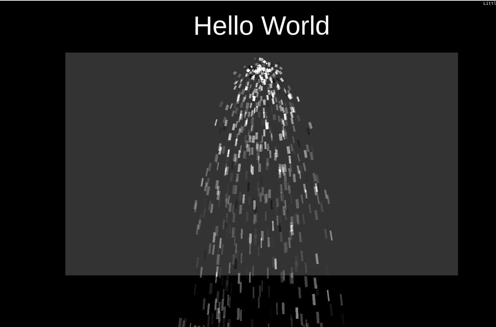

# littlejs-demo

A simple demo of the LittleJS game engine using TypeScript.

## Introduction

...



## Installation

```bash
git clone https://github.com/kgish/littlejs-demo.git
cd littlejs-demo
yarn
```

## Run

```bash
yarn dev
```

Point your favorite browser to `http://localhost:1234` and enjoy!

## Build

```bash
yarn build
```

## Lint

```bash
yarn lint
```

## Test

```bash
yarn test
```

## References

* [LittleJS]()
* [Parcel](https://parceljs.org)
* [TypeScript](https://www.typescriptlang.org)
* [EsLint](https://eslint.org)
* [Stylelint](https://stylelint.io)
